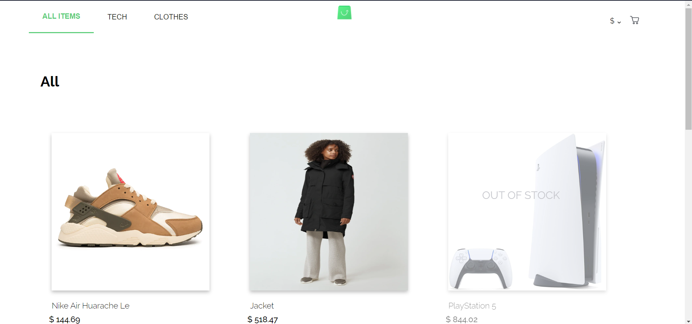
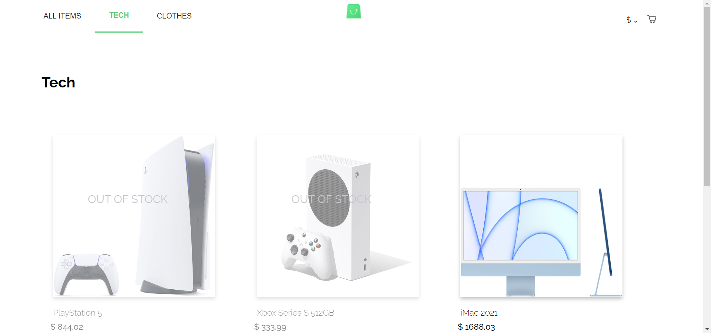
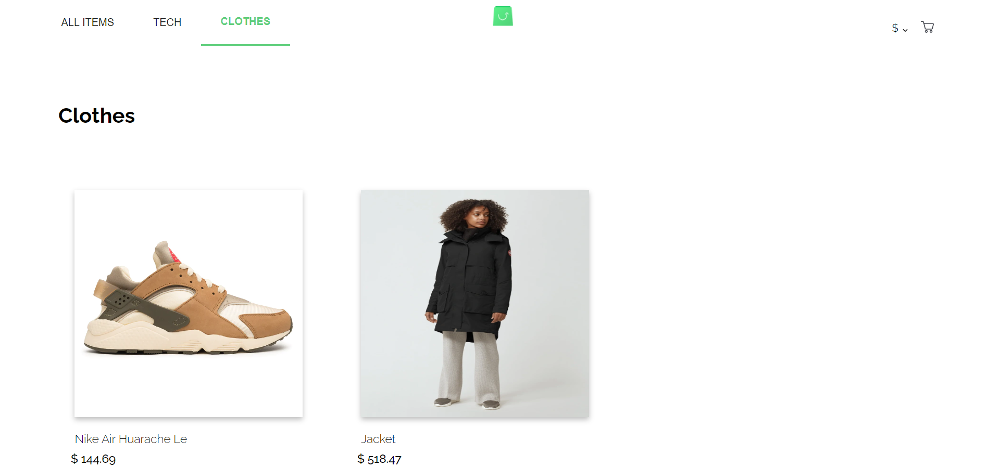
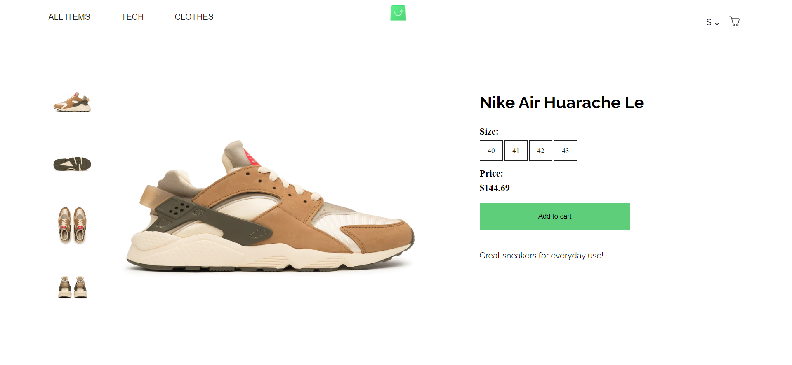
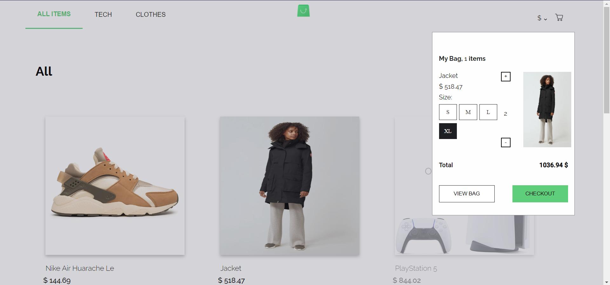
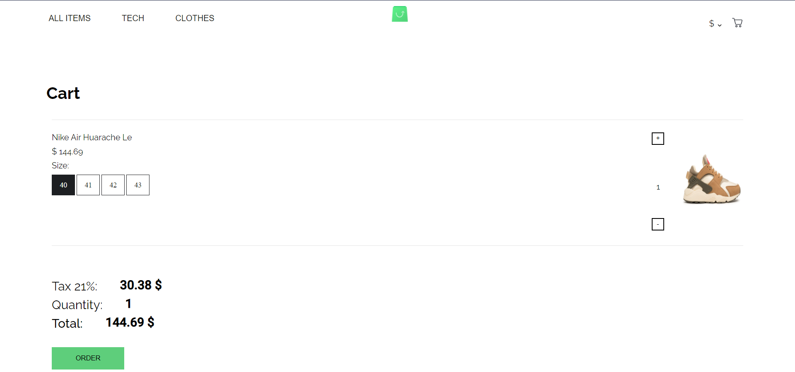
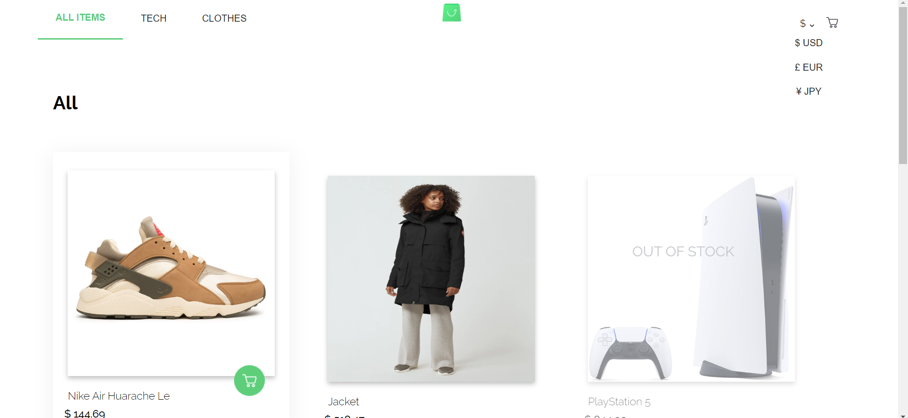

# Shop-task


## Run Locally

Clone the project

```bash
  git clone https://github.com/eslamwaeldev/ScandiWeb-Shop-task
```


Go to the project directory

```bash
  cd ScandiWeb-Shop-task
```

Install dependencies for backend 

```bash
  cd backend
```

```bash
  yarn 
```

Install dependencies for frontend 

```bash
  cd frontend
```

```bash
  npm install
```

Start the backend server

```bash
  yarn dev
```

Start the frontend server

```bash
  npm start
```

##Demo
















## Features

- This an online shop implemented with ReactJS using apollo client to fetch data froma graphQL server

- The Navbar and the modal are styled using the Styled components

